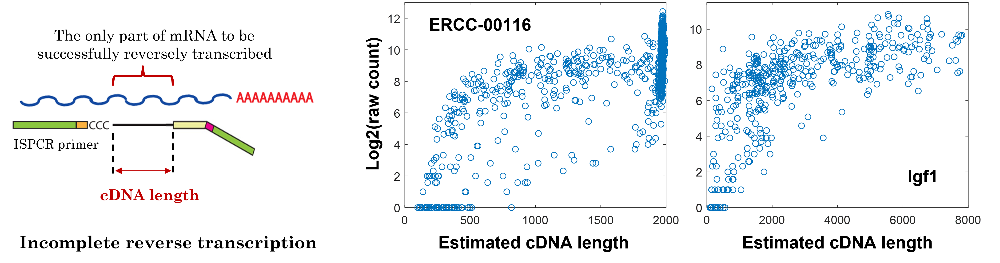
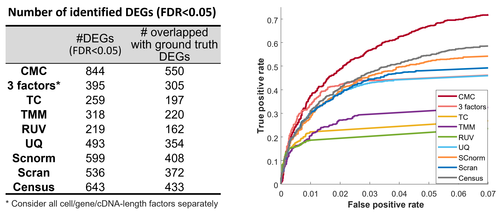

# Overview

The raw count of single-cell RNA-seq (scRNA-seq) data impacted by artificial factors, including the cell factor and the gene factor. Besides, we found that, for full-length sequencing techniques, such as Smart-seq2, the cDNA-length factor also has a non-negligible impact on the final raw counts. 

The CMC model was applied to jointly infer these three factors and then to normalize out the unwanted factors.


# Cell/gene/cDNA-length factors
<!--
Cell factors: (such as cell’s library size that will directly impact the total counts of the cell)

Gene factors: (such as GC content of the gene’s sequence that may impact the efficiency of PCR amplification)

cDNA-length factor:
-->


The raw count of single-cell RNA-seq (scRNA-seq) data impacted by artificial factors, including the cell factor (such as cell’s library size that will directly impact the total counts of the cell) and the gene factor (such as GC content of the gene’s sequence that may impact the efficiency of PCR amplification). 

Besides, we found that, for full-length sequencing techniques, such as Smart-seq2, the cDNA-length factor also has a non-negligible impact on the final raw counts. 


<p align="center">
  
</p>


# What if we consider these factors separately?
Illustrated example of consider cell and gene factors separately vs jointly.

<p align="center">
  
</p>

# Results on example scRNA-seq data [3]

<p align="center">
  
</p>


<p align="center">
  
</p>


# Installation

```
library(devtools)
devtools::install_github("yu-lab-vt/CMC@CMC-3DNorm")
```

# Example usage

```
library(scNorm3D)
#file_Exp:a csv file name that stored the raw count of scRNA-seq data (row:sample; col:gene)
#file_cDNA_Length:a csv file name that stored the cDNA lengthes of each gene in each cell (row:sample; col:gene)
dataNorm <- scNorm3D(file\_Exp, file\_cDNA\_Length)
```


<!--
# How it work?

**Input**: (1) scRNA-seq data to be tested; (2) Signatures of target cell type. <br>
**Output**: Similarity level of each single cell to the target cell type (p-value & similarity score)

A cell is believed to be similar to a target cell type at the transcriptional level if it statistically significantly highly expresses the signatures of the target cell type than expected by random. Given the inputs, TySim performs statistical test to access the similarity levels.


# Case studies
### 1) TySim confirms that Proliferative-region-associated microglia (PAM) is similar to disease-associated microglia (DAM) 

<br>


<p align="center">
  
</p>


### 2) TySim reveals cell type neglected by clustering due to small group size 

<br>
<p align="center">
  
</p>

<div style="height: 5px;"></div>

### 3) TySim enables the identification of cell type that was not discovered due to contamination in scRNA-seq data

<br>
<p align="center">
  
</p>

<div style="height: 5px;"></div>


# Cite

Please cite our paper if you find the code useful for your research.

Z. Cheng, S. Wei and G. Yu, "[A Single-Cell-Resolution Quantitative Metric of Similarity to a Target Cell Type for scRNA-seq Data](https://ieeexplore.ieee.org/abstract/document/9995574)," 2022 IEEE International Conference on Bioinformatics and Biomedicine (BIBM), Las Vegas, NV, USA, 2022, pp. 2824-2831, doi: 10.1109/BIBM55620.2022.9995574.


```
@inproceedings{TySim,
  title={A Single-Cell-Resolution Quantitative Metric of Similarity to a Target Cell Type for scRNA-seq Data},
  author={Cheng, Zuolin and Wei, Songtao and Yu, Guoqiang},
  booktitle={2022 IEEE International Conference on Bioinformatics and Biomedicine (BIBM)},
  pages={2824--2831},
  year={2022},
  organization={IEEE}
}
```
-->


# Reference
[1]	Q. Li, Z. Cheng, L. Zhou, S. Darmanis, N. F. Neff, J. Okamoto et al., “Developmental heterogeneity of microglia and brain myeloid cells revealed by deep single-cell RNA sequencing,” Neuron, vol. 101, no. 2, pp. 207-223. e10, 2019.

[2]	H. Keren-Shaul, A. Spinrad, A. Weiner, O. Matcovitch-Natan, R. Dvir-Szternfeld, T. K. Ulland et al., “A unique microglia type associated with restricting development of Alzheimer’s disease,” Cell, vol. 169, no. 7, pp. 1276-1290. e17, 2017.

[3]	E. Caglayan, Y. Liu, and G. Konopka, “Neuronal ambient RNA contamination causes misinterpreted and masked cell types in brain single-nuclei datasets,” Neuron, 2022 

[4]	S. Marques, A. Zeisel, S. Codeluppi, D. Van Bruggen, et al., “Oligodendrocyte heterogeneity in the mouse juvenile and adult central nervous system,” Science, vol. 352, no. 6291, pp. 1326-1329, 2016.

[5]	D. Velmeshev, L. Schirmer, D. Jung, M. Haeussler, Y. Perez, S. Mayer et al., “Single-cell genomics identifies cell type–specific molecular changes in autism,” Science, vol. 364, no. 6441, pp. 685-689, 2019.

[6]	T. Masuda, R. Sankowski, O. Staszewski, and M. Prinz, “Microglia heterogeneity in the single-cell era,” Cell reports, vol. 30, no. 5, pp. 1271-1281, 2020.

[7]	T. R. Hammond, C. Dufort, L. Dissing-Olesen, S. Giera, A. Young, A. Wysoker et al., “Single-cell RNA sequencing of microglia throughout the mouse lifespan and in the injured brain reveals complex cell-state changes,” Immunity, vol. 50, no. 1, pp. 253-271. e6, 2019.

