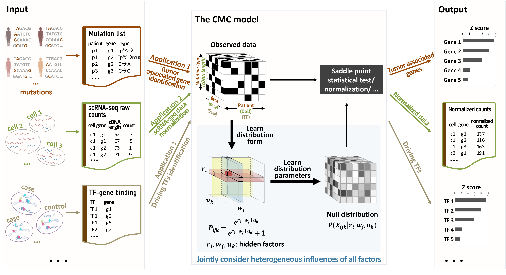
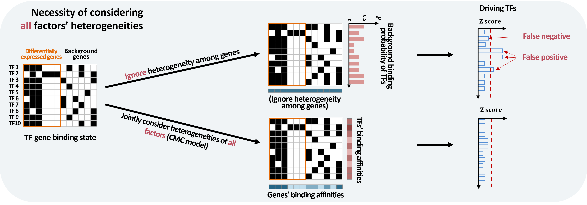
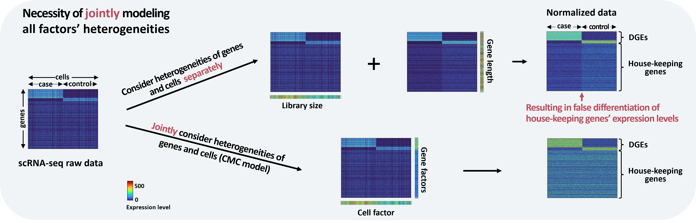
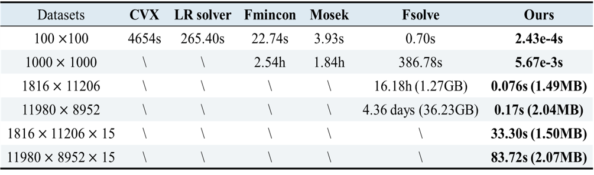
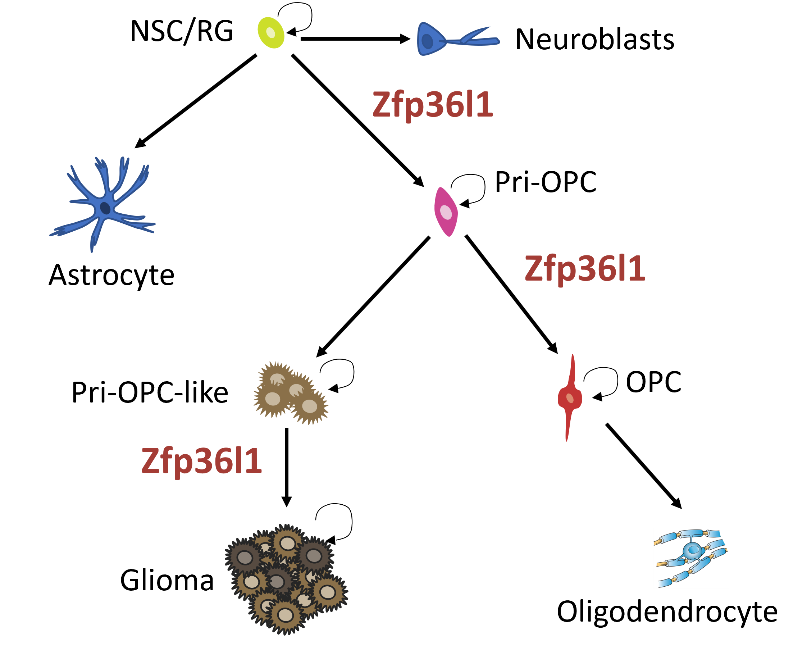
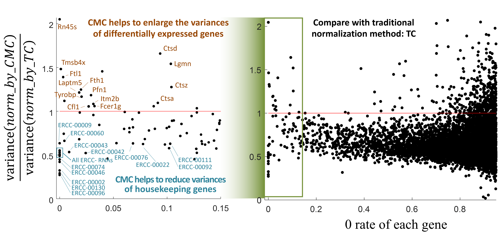
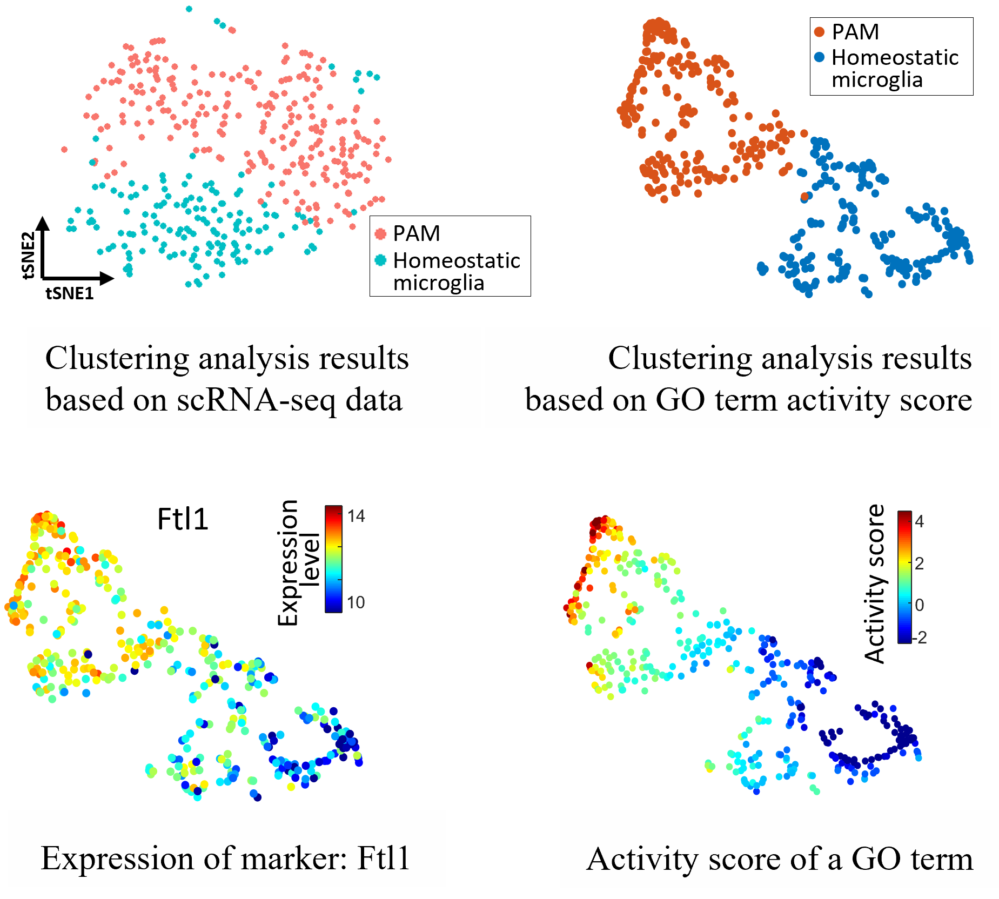

# What is CMC?

The observed data are often influenced by numerous intrinsic or extrinsic factors at the same time, which may distort or even bury the impact of variables of real interest. Explicitly modeling the effects of a large number of factors is challenging, as no reliable prior  knowledge is available on how these factors exert their effects, as well as to what degree the effects are. What’s more, the numerous factors’ effects are often intertwined, and call for joint consideration of all the factors.

Conditional Multifactorial Contingency (CMC) is a model to jointly learn the multifactorial effect in large-scale data. Specifically, it reformulates the data as a contingency tensor with each dimension corresponding to a factor class, and then systematically models and learns the multiple factors as well as the joint probability distribution conditional on these factor.
<br>
<!-- If you have any feedback or issue, you are welcome to either post issue in the Issues section or send an email to yug@vt.edu (Guoqiang Yu at Virginia Tech). -->

<p align="center">
  
  <!--  <figcaption>Overview of TySim</figcaption> -->
</p>

# Why do we need CMC ?

CMC jointly learn the multifactorial effect in data, which helps to mitigate the distort of these factors on signal of real interest. And therefore, reduce false negatives and false positive in the downstream analysis.

<p align="center">
  
</p>

<p align="center">
  
</p>

<!--
# How it work?

**Input**: (1) scRNA-seq data to be tested; (2) Signatures of target cell type. <br>
**Output**: Similarity level of each single cell to the target cell type (p-value & similarity score)

A cell is believed to be similar to a target cell type at the transcriptional level if it statistically significantly highly expresses the signatures of the target cell type than expected by random. Given the inputs, TySim performs statistical test to access the similarity levels.
-->

# Efficiency comparison of different optimization solvers

<p align="center">
  
</p>

In the table, “LR solver” is short for logistic regression solver; “\” means either out of memory or running time is too long (> 5 days) to be recorded. The last four rows are the data sizes coming from real studies.


<!--
# Why TySim?

To the best of our knowledge, TySim is the first quantitative metric of similarity towards a target cell type.

### Features of TySim:

1) **Single-cell resolution**: TySim quantities the similarity level of each single cell to a given cell type. Working on single cells also means that TySim does not require clustering and are free of the headaches in clustering, e.g. tiny cell group or inseparable groups. 

2) **Cross platform**: insensitive to the sequencing platform of input scRNA-seq dataset and the platform from which the signatures of target cell types coming.

### TySim is powerful in a few aspects:

1) Special designed to handle the drop-out effect in scRNA-seq datasets.

2) TySim carefully considers the background expression level of each gene in each cell. Such background expression levels are accurately estimated by systematically modeling both cell factors and gene factors in the inputted scRNA-seq data. This is achieved by employing the Conditional Multifactorial Contingency (CMC) model.
-->


# Example applications of CMC
## 1) Application 1: driving transcription factor (TF) identification
This application is to identify the TFs that are responsible for the transcription change of biological processes or diseases. In this application, CMC is applied to systematically models both the gene and TF heterogeneity in binding affinities, and achieves a more powerful detection results.

#### Results on 49 benchmark datasets [1]

In each dataset, targeted TF was perturbed and DEGs were detected. We feed the DEGs to the model and check if the perturbed TF was successfully identified.

<p align="center">
  
</p>

####  Results on real study [2]
Successfully identified Zfp36l1 as a critical regulator for oligodendrocyteastrocyte lineage transition and glioma growth [2].

<p align="center">
  
</p>


## Application 2: scRNA-seq normalization

The raw count of single-cell RNA-seq (scRNA-seq) data impacted by artificial factors, including the cell factor (such as cell’s library size that will directly impact the total counts of the cell) and the gene factor (such as GC content of the gene’s sequence that may impact the efficiency of PCR amplification). Besides, we found that, for full-length sequencing techniques, such as Smart-seq2, the cDNA-length factor also has a non-negligible impact on the final raw counts. The CMC model was applied to jointly infer these three factors and then to normalize out the unwanted factors.

####  Results on example scRNA-seq data [3]
<p align="center">
  
</p>

## Application 3: cancer-associated gene identification

<p align="center">
  
</p>


## Application 4: quantification of single-cell-level similarity (TySim)

TySim is a quantitative metric of single-cell-to-target-cell-type similarity, on the basis of scRNA-seq data and the signatures or differentially expressed gene (DEG) list of the target cell type. In other words, it quantifies to what level each single cell is similar to the target cell type. 

TySim carefully considers the background expression level of each gene in each cell. Such background expression levels are accurately estimated by systematically modeling both cell factors and gene factors in the inputted scRNA-seq data. This is achieved by employing the CMC model.

#### 1) TySim confirms that Proliferative-region-associated microglia (PAM) is similar to disease-associated microglia (DAM)
<br>

<p align="center">
  
</p>

#### 2) TySim reveals cell type neglected by clustering due to small group size 

<br>
<p align="center">
  
</p>

<div style="height: 5px;"></div>

#### 3) TySim enables the identification of cell type that was not discovered due to contamination in scRNA-seq data

<br>
<p align="center">
  
</p>

<div style="height: 5px;"></div>


## Application 5: GO term activity transformation

It's a model to transform the scRNA-seq dataset into GO term activity score. The GO term activity score matrix represents the activity level of each GO term (i.e., biological process) in each cell. Comparing with the scRNA-seq data, the activity score is expected to be more reliable and more sensitive to cell heterogeneity.

In this application, the CMC model is used to accurately estimate the gene-level expression bias in each single cell by jointly modeling the cell and gene factors in the data. 


#### Application to a real dataset that contained homeostatic microglia and Proliferative-region-associated microglia (PAM) [3] 
<br>


<p align="center">
  
</p>


# Installation

==== R ====
```
library(devtools)
devtools::install_github("yu-lab-vt/CMC")
```

# Example usage

```
library(CMC)

# Create the random 2D tensor
x_dim <- 50
y_dim <- 60
tensor <- array(runif(x_dim * y_dim), dim = c(x_dim, y_dim))

# (Optional) Randomly set 20% items as missing values
random_values <- sample(c(0, 1), x_dim * y_dim, replace = TRUE, prob = c(0.2, 0.8))
item_used_random <- array(random_values, dim = c(x_dim, y_dim))

# CMC model
res <- CMC(tensor,Y = 1, items_used = item_used_random)

# The probability distribution
P <- res$P

# A list storing the strength of each factor's impact
rA <- res$rA
```


# Cite

Please cite our paper if you find the code useful for your research.

Zuolin Cheng, Songtao Wei, Yinxue Wang, Yizhi Wang, Richard Lu, Yue Wang, Guoqiang Yu， "[An Efficient and Principled Model to Jointly Learn the Agnostic and Multifactorial Effect in Large-Scale Biological Data](https://www.biorxiv.org/content/10.1101/2024.04.12.589306v1)," bioRxiv 2024.04.12.589306; doi: https://doi.org/10.1101/2024.04.12.589306

Z. Cheng, S. Wei and G. Yu, "[A Single-Cell-Resolution Quantitative Metric of Similarity to a Target Cell Type for scRNA-seq Data](https://ieeexplore.ieee.org/abstract/document/9995574)," 2022 IEEE International Conference on Bioinformatics and Biomedicine (BIBM), Las Vegas, NV, USA, 2022, pp. 2824-2831, doi: 10.1109/BIBM55620.2022.9995574.


```
@article{cheng2024efficient,
  title={An Efficient and Principled Model to Jointly Learn the Agnostic and Multifactorial Effect in Large-Scale Biological Data},
  author={Cheng, Zuolin and Wei, Songtao and Wang, Yinxue and Wang, Yizhi and Lu, Richard and Wang, Yue and Yu, Guoqiang},
  journal={bioRxiv},
  pages={2024--04},
  year={2024},
  publisher={Cold Spring Harbor Laboratory}
}

@inproceedings{TySim,
  title={A Single-Cell-Resolution Quantitative Metric of Similarity to a Target Cell Type for scRNA-seq Data},
  author={Cheng, Zuolin and Wei, Songtao and Yu, Guoqiang},
  booktitle={2022 IEEE International Conference on Bioinformatics and Biomedicine (BIBM)},
  pages={2824--2831},
  year={2022},
  organization={IEEE}
}
```


# Contact us

If you need any assistance with running the packages, please contact songtaow@vt.edu or zuolin8@vt.edu


# Reference

[1]	Qin, Qian, et al. "Lisa: inferring transcriptional regulators through integrative modeling of public chromatin accessibility and ChIP-seq data." Genome biology 21.1 (2020): 1-14.

[2] Weng, Qinjie, et al. "Single-cell transcriptomics uncovers glial progenitor diversity and cell fate determinants during development and gliomagenesis." Cell stem cell 24.5 (2019): 707-723.

[3]	Q. Li, Z. Cheng, L. Zhou, S. Darmanis, N. F. Neff, J. Okamoto et al., “Developmental heterogeneity of microglia and brain myeloid cells revealed by deep single-cell RNA sequencing,” Neuron, vol. 101, no. 2, pp. 207-223. e10, 2019.

[4] Lawrence, Michael S., et al. "Mutational heterogeneity in cancer and the search for new cancer-associated genes." Nature 499.7457 (2013): 214-218.

[5]	H. Keren-Shaul, A. Spinrad, A. Weiner, O. Matcovitch-Natan, R. Dvir-Szternfeld, T. K. Ulland et al., “A unique microglia type associated with restricting development of Alzheimer’s disease,” Cell, vol. 169, no. 7, pp. 1276-1290. e17, 2017.

[6]	E. Caglayan, Y. Liu, and G. Konopka, “Neuronal ambient RNA contamination causes misinterpreted and masked cell types in brain single-nuclei datasets,” Neuron, 2022 

[7]	S. Marques, A. Zeisel, S. Codeluppi, D. Van Bruggen, et al., “Oligodendrocyte heterogeneity in the mouse juvenile and adult central nervous system,” Science, vol. 352, no. 6291, pp. 1326-1329, 2016.

[8]	D. Velmeshev, L. Schirmer, D. Jung, M. Haeussler, Y. Perez, S. Mayer et al., “Single-cell genomics identifies cell type–specific molecular changes in autism,” Science, vol. 364, no. 6441, pp. 685-689, 2019.

[9]	T. Masuda, R. Sankowski, O. Staszewski, and M. Prinz, “Microglia heterogeneity in the single-cell era,” Cell reports, vol. 30, no. 5, pp. 1271-1281, 2020.

[10]	T. R. Hammond, C. Dufort, L. Dissing-Olesen, S. Giera, A. Young, A. Wysoker et al., “Single-cell RNA sequencing of microglia throughout the mouse lifespan and in the injured brain reveals complex cell-state changes,” Immunity, vol. 50, no. 1, pp. 253-271. e6, 2019.
