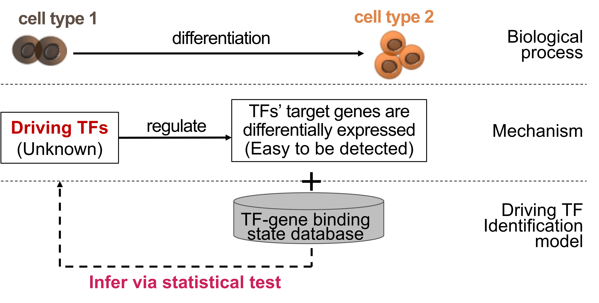
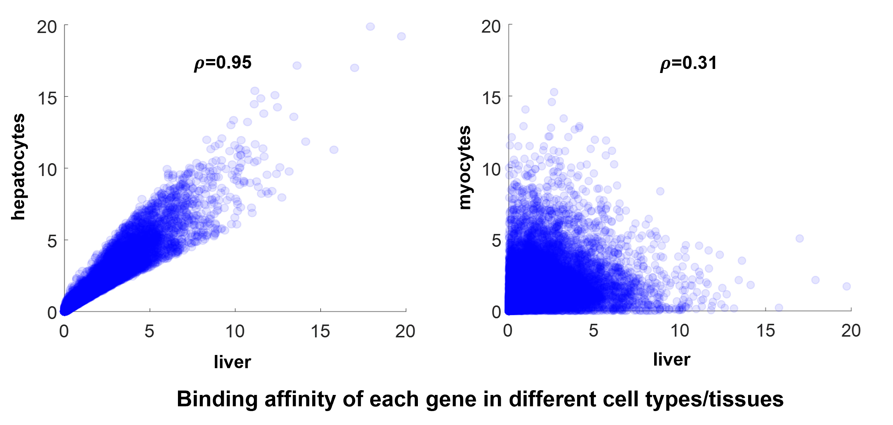
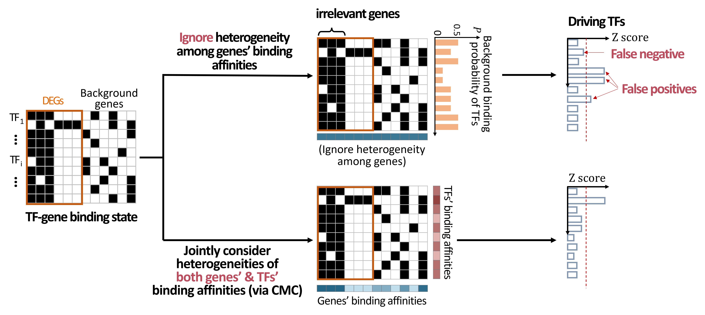
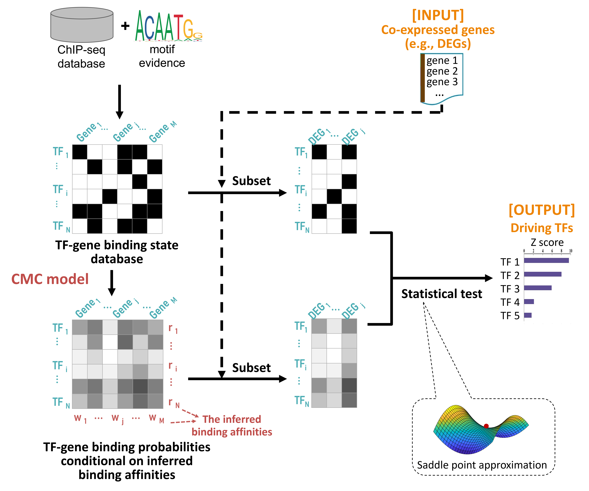
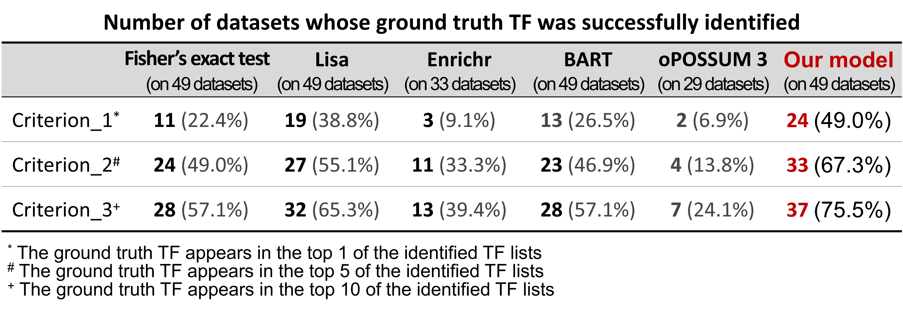
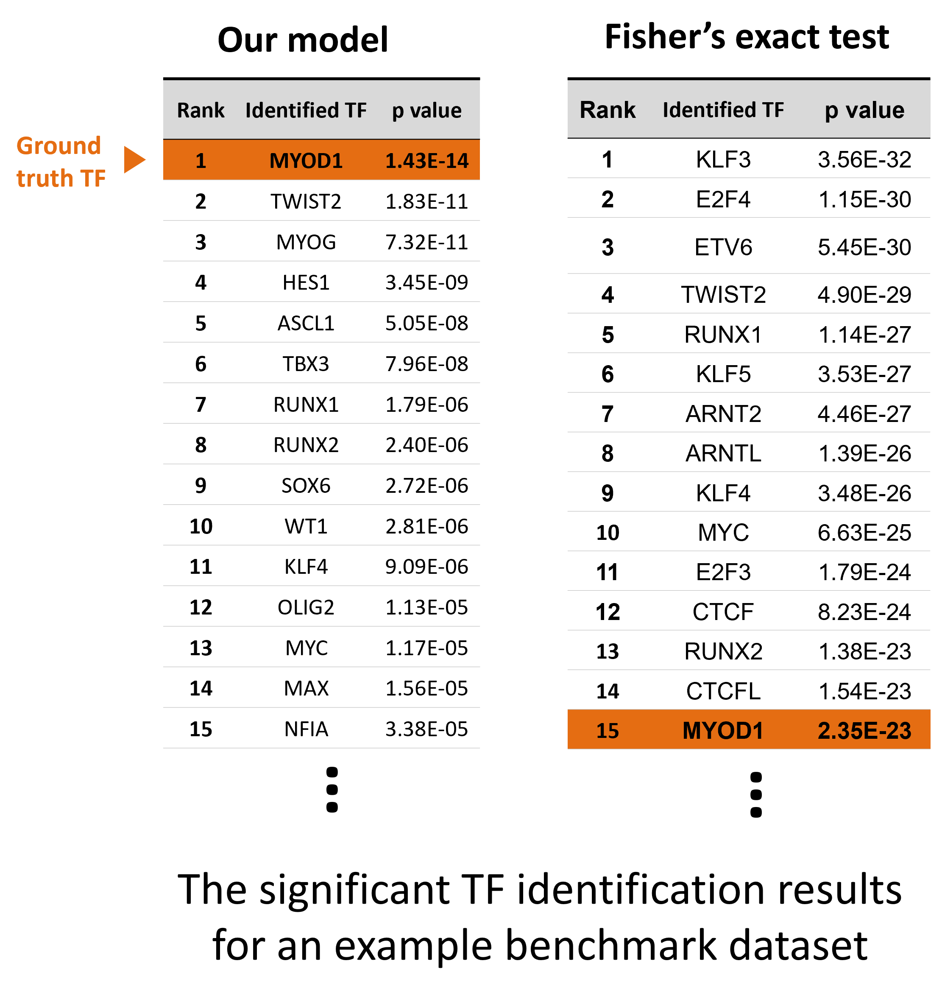

# What is driving TF identification?

Driving TF identification is to identify the transportation factors (TFs) that are responsible for the transcription change of biological processes or diseases. Our method systematically models both the gene and TF heterogeneity in binding affinities, and achieves a more powerful detection results.


<!-- If you have any feedback or issue, you are welcome to either post issue in the Issues section or send an email to yug@vt.edu (Guoqiang Yu at Virginia Tech). -->

<!--  ### Overview of TySim -->
<p align="center">
  
  <!--  <figcaption>Overview of TySim</figcaption> -->
</p>


**Input**: a set of co-expressed genes (e.g., DEGs) of interest <br>
**Output**: Driving TF candidates

**Basic idea of identification:** TFs initiate and regulate the transcription of genes by binding to the enhancer or promoter sequences of their target genes. The basic idea behind the identification is to identify the TFs that bind to the co-expression genes more frequently than they would be at random.

# Gene/TF heterogeneity in binding affinity

Each TF or gene has different binding affinities (i.e., how likely a TF tends to bind any gene, or how likely a gene is bound by any TF). 

What's more, binding affinity of gene/TF are various and are cell type specific.

<p align="center">
  
  <!--  <figcaption>Overview of TySim</figcaption> -->
</p>


# What if ignore the heterogeneities ?

* Overlooks the evidence from important genes and TFs
* Falls in the traps of irrelevant genes and TFs
* **Results in false negatives and false positives**

<p align="center">
  
  <!--  <figcaption>Overview of TySim</figcaption> -->
</p>


# Overview of our model


<p align="center">
  
  <!--  <figcaption>Overview of TySim</figcaption> -->
</p>


## Highlights 

* **Both gene binding affinities and TF binding affinities** are systematically modeled via our Conditional Multifactorial Contingency (CMC) model
* The heterogeneity of binding affinities among **cell types** is also carefully considered
* Saddle point approximation makes **high-resolution statistical test** (imbedding various binding affinities) possible
* **Robust build-in TF-gene binding state databases**: ChIP-seq experiments + motif evidence


# Results on 49 benchmark datasets [1] 
In each dataset, targeted TF was perturbed and DEGs were detected. We feed the DEGs to the model and check if the perturbed TF was successfully identified.


<p align="center">
  
  <!--  <figcaption>Overview of TySim</figcaption> -->
</p>


### Result on an example benchmark dataset
<p align="center">
  
  <!--  <figcaption>Overview of TySim</figcaption> -->
</p>


# Installation

```
library(devtools)
devtools::install_github("yu-lab-vt/CMC@CMC-DrivingTFDetection")
```

# Example usage

library(DrivingTFDetection)


\# Get example DEG list (obtained by comparing the gene expression levels in mouse with MYOD1 mutated v.s. wide type [3])
```
DEGs_example_MYOD1 <- getTestGeneSet()
```

\# Driving TF factor identification 
```
result<-DrivingTFDetection_ChIPseq_Mouse(DEGs_example_MYOD1)
```

\# Example output
```
head(result,15)
```
<p align="left">
  
  <!--  <figcaption>Overview of TySim</figcaption> -->
</p>


<!--
# Cite

...
-->

# Cite

Please cite our paper if you find the code useful for your research.

Zuolin Cheng, Songtao Wei, Yinxue Wang, Yizhi Wang, Richard Lu, Yue Wang, Guoqiang Yu， "[An Efficient and Principled Model to Jointly Learn the Agnostic and Multifactorial Effect in Large-Scale Biological Data](https://www.biorxiv.org/content/10.1101/2024.04.12.589306v1.full.pdf)," bioRxiv 2024.04.12.589306; doi: https://doi.org/10.1101/2024.04.12.589306


```
@article{cheng2024efficient,
  title={An Efficient and Principled Model to Jointly Learn the Agnostic and Multifactorial Effect in Large-Scale Biological Data},
  author={Cheng, Zuolin and Wei, Songtao and Wang, Yinxue and Wang, Yizhi and Lu, Richard and Wang, Yue and Yu, Guoqiang},
  journal={bioRxiv},
  pages={2024--04},
  year={2024},
  publisher={Cold Spring Harbor Laboratory}
}
```

# Contact us

If you need any assistance with running the packages, please contact songtaow@vt.edu or zuolin8@vt.edu


# Reference
[1]	Qin, Qian, et al. "Lisa: inferring transcriptional regulators through integrative modeling of public chromatin accessibility and ChIP-seq data." Genome biology 21.1 (2020): 1-14.

[2] Puig, Rafael Riudavets, et al. "UniBind: maps of high-confidence direct TF-DNA interactions across nine species." BMC genomics 22.1 (2021): 1-17.

[3] Di Padova, Monica, et al. "MyoD acetylation influences temporal patterns of skeletal muscle gene expression." Journal of Biological Chemistry 282.52 (2007): 37650-37659.


