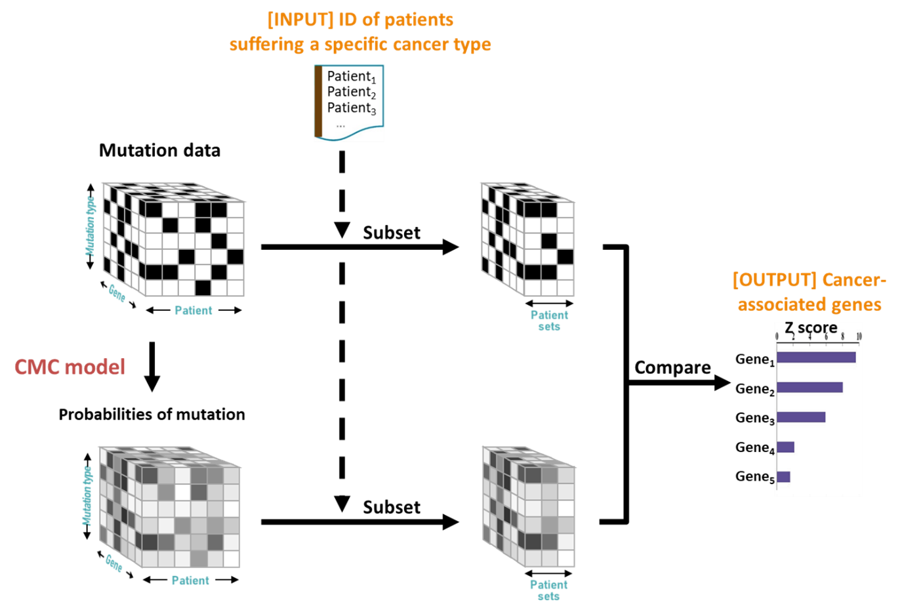
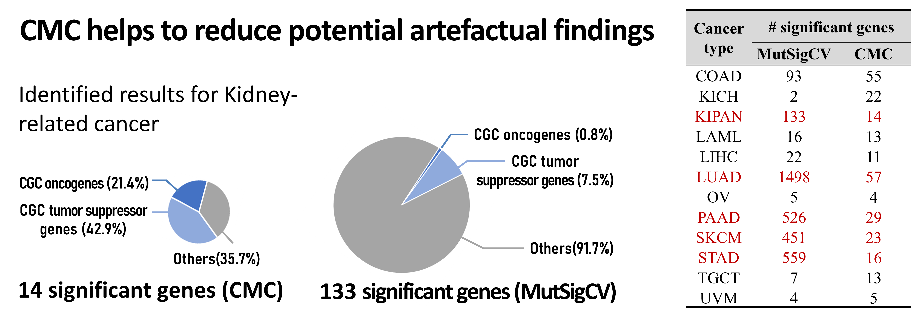
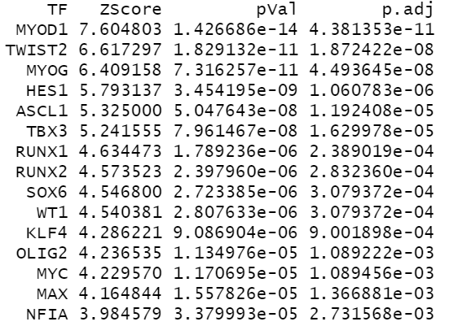

# What is CancerGeneFinder?

CancerGeneFinder is to identify the genes whose mutations are responsible for a particular cancer initiation and progression.

**Basic idea of identification:** To detect the genes with significantly more mutations than expected by chance. We used the genomic mutation data from 8544 patients across all major cancer types from The
Cancer Genome Atlas (TCGA), in which the whole-genome sequencing is performed to identify the genomic mutations in each cancer patient.


# Key factors: patient/gene/mutation-type factors

As reported in [1], the mutation rates vary across patients, genome regions, and mutation categories (such as CpG transversions, C:G transitions, A:T transversions, etc.) Besides, such diversities between each factor (patient, gene, and mutation category) are twisted together.

MutSigCV [1] consider the diversities of these three factors. However, it treated the three factors
independently and estimated the expected mutation number using the product of marginal
relative rates of these factors. As a result, MutSigCV identified as more as ~1500 significant cancer-associated genes for cancer type "LUAD", with most of them are suspicious to be false positives.

# Overview of our model

Here we applied the CMC model to jointly consider all these three
factors in the mutation data, so as to reduce the potential artificial findings. The framework of the detection is shown in the following figure. The mutation counts are stored in a
tensor of three dimensions, corresponding to the patient, gene, and mutation category factors,
respectively.

<p align="center">
  
  <!--  <figcaption>Overview of TySim</figcaption> -->
</p>


# Results
Number of significant genes identified for different types of cancer by the CMC model and MutSigCV


<p align="center">
  
  <!--  <figcaption>Overview of TySim</figcaption> -->
</p>


<span style="font-size: 0.8em;">
Note: adrenocortical carcinoma (ACC), bladder urothelial carcinoma (BLCA), Breast invasive carcinoma (BRCA), cervical and endocervical cancers (CESC), cholangiocarcinoma (CHOL), colon adenocarcinoma (COAD), colorectal adenocarcinoma (COADREAD), lymphoid neoplasm diffuse large B-cell lymphoma (DLBC), esophageal carcinoma (ESCA), glioblastoma multiforme (GBM), glioma (GBMLGG), head and neck squamous cell carcinoma (HNSC), kidney chromophobe (KICH), Pan-kidney cohort (KICH+KIRC+KIRP) (KIPAN), acute myeloid leukemia (LAML), liver hepatocellular carcinoma (LIHC), lung adenocarcinoma (LUAD), lung squamous cell carcinoma (LUSC), ovarian serous cystadenocarcinoma (OV), pancreatic adenocarcinoma (PAAD), pheochromocytoma and paraganglioma (PCPG), prostate adenocarcinoma (PRAD), sarcoma (SARC), skin cutaneous melanoma (SKCM), stomach adenocarcinoma (STAD), testicular germ cell tumors (TGCT), thyroid carcinoma (THCA), thymoma (THYM), uterine corpus endometrial carcinoma (UCEC), uterine carcinosarcoma (UCS), uveal melanoma (UVM).
</span>


# Installation

```
library(devtools)
devtools::install_github("yu-lab-vt/CMC@CMC-CancerGeneFinder")
```

<!--
# Example usage

library(DrivingTFDetection)


\# Get example DEG list (obtained by comparing the gene expression levels in mouse with MYOD1 mutated v.s. wide type [3])
```
DEGs_example_MYOD1 <- getTestGeneSet()
```

\# Driving TF factor identification 
```
result<-DrivingTFDetection_ChIPseq_Mouse(DEGs_example_MYOD1)
```

\# Example output
```
head(result,15)
```
<p align="left">
  
</p>


# Cite

...
-->

# Cite

Please cite our paper if you find the code useful for your research.

Zuolin Cheng, Songtao Wei, Yinxue Wang, Yizhi Wang, Richard Lu, Yue Wang, Guoqiang Yu， "[An Efficient and Principled Model to Jointly Learn the Agnostic and Multifactorial Effect in Large-Scale Biological Data](https://www.biorxiv.org/content/10.1101/2024.04.12.589306v1.full.pdf)," bioRxiv 2024.04.12.589306; doi: https://doi.org/10.1101/2024.04.12.589306


```
@article{cheng2024efficient,
  title={An Efficient and Principled Model to Jointly Learn the Agnostic and Multifactorial Effect in Large-Scale Biological Data},
  author={Cheng, Zuolin and Wei, Songtao and Wang, Yinxue and Wang, Yizhi and Lu, Richard and Wang, Yue and Yu, Guoqiang},
  journal={bioRxiv},
  pages={2024--04},
  year={2024},
  publisher={Cold Spring Harbor Laboratory}
}
```

# Contact us

If you need any assistance with running the packages, please contact songtaow@vt.edu or zuolin8@vt.edu


# Reference
[1]	Qin, Qian, et al. "Lisa: inferring transcriptional regulators through integrative modeling of public chromatin accessibility and ChIP-seq data." Genome biology 21.1 (2020): 1-14.

[2] Puig, Rafael Riudavets, et al. "UniBind: maps of high-confidence direct TF-DNA interactions across nine species." BMC genomics 22.1 (2021): 1-17.

[3] Di Padova, Monica, et al. "MyoD acetylation influences temporal patterns of skeletal muscle gene expression." Journal of Biological Chemistry 282.52 (2007): 37650-37659.


