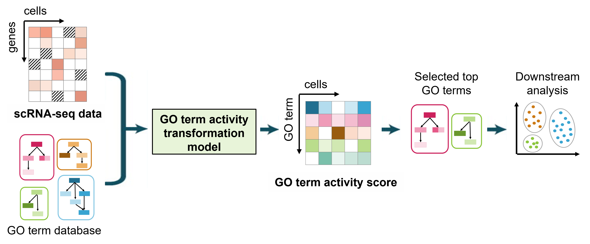

# What is GO term activity transformation?

It's a model to transform the scRNA-seq dataset into GO term activity score. Compare with the scRNA-seq dataset, which represents the expression level of each single gene in each cell, the GO term activity score matrix represents the activity level of each GO term (i.e., biological process) in each cell. 


<!-- If you have any feedback or issue, you are welcome to either post issue in the Issues section or send an email to yug@vt.edu (Guoqiang Yu at Virginia Tech). -->

<!--  ### Overview of TySim -->
<p align="center">
  
  <!--  <figcaption>Overview of TySim</figcaption> -->
</p>


# Why do we need the transformation?

### scRNA-seq:
* Highly noisy
* Suffered from the drop-out effect

Limit its power in the cell heterogeneity analyses

### GO term activity score
* **More reliable**: the GO term activity score is account for the expressions of multiple functional related genes
* **More sensitive to cell heterogeneity**: the gene-level expression bias can be modeled and captured by our CMC model, such that genes expressed homogeneously in the cell population will have less contribution to the final activity scores.


# Case study using GO term activity transformation
### Application to a real dataset that contained homeostatic microglia and Proliferative-region-associated microglia (PAM) [1] 
<br>


<p align="center">
  
</p>


# Installation

```
library(devtools)
devtools::install_github("yu-lab-vt/CMC@CMC-GOTermActivity")
```


# Example usage

```
library(Gotana)
library(Seurat)
library(matrixStats)
```

``` 
# Read Raw count
GO_analysis_example <- Read_scData("GE_Data.txt", Str_mt = "mt-")
```
```
# Quality Control
GO_analysis_example <- QC_scData(GO_analysis_example, Gene_threshold = 0.05,
                                 Count_threshold = 3.5, Cell_threshold = 1500, MT_threshold = 0.2)
```
```
# Map to GO Term Dataset
GO_analysis_example <- Map_GOSet(GO_analysis_example)

# Run CMC Model
GO_analysis_example <- Run_CMC(GO_analysis_example)

# Calculate GO Term Activity Scores
GO_analysis_example <- GO_Scores(GO_analysis_example)

# Feature Selection: Using Order Statistics Tests
GO_analysis_example <- GO_selected_Order_Statistics(GO_analysis_example)

# Run PCA
GO_analysis_example <- Run_PCA(GO_analysis_example, Selected_GOs = 255, Score_type = "p_value")

# Build Seurat Object
GO_analysis_example <- Create_Seurat_Object(GO_analysis_example)

#Analysis using "Seurat" function
Seurat_GO_example <- GO_analysis_example$Seurat_GO

DimHeatmap(Seurat_GO_example, dims = 1, cells = 1000, balanced = TRUE)

Seurat_GO_example <- FindNeighbors(Seurat_GO_example, dims = 1:10)

Seurat_GO_example <- FindClusters(Seurat_GO_example, resolution = 0.5)

Seurat_GO_example <- RunUMAP(Seurat_GO_example, dims = 1:10)

DimPlot(Seurat_GO_example, reduction = "umap", pt.size = 1)

FeaturePlot(Seurat_GO_example, features = c("GO:0010976","GO:0016126", "GO:0006695", "GO:0006357"), pt.size = 1)

cluster2.markers <- FindMarkers(Seurat_GO_example, ident.1 = 2, min.pct = 0.25)

# For Further Analysis
GO_analysis_example <- Update_Seurate(GO_analysis_example, Seurat_GO_example)

# Detect DEGs
Cluster_Results <- GO_analysis_example$AfterMapping_List$Cluster
Cluster_0 <- GO_analysis_example$AfterQC_List$Cell_ID[Cluster_Results == '0']
Cluster_1 <- GO_analysis_example$AfterQC_List$Cell_ID[Cluster_Results == '1']
Cluster_2 <- GO_analysis_example$AfterQC_List$Cell_ID[Cluster_Results == '2']
Markers_Cluster0 <- Markers_Detection(GO_analysis_example, Cluster_0, c(Cluster_1,Cluster_2), 
                                      Flag_testAllgene = FALSE, min.pct = 0.1, logfc.threshold = 0.25, only.pos = TRUE)

# Plot Gene Expression Figure
GenePlot(GO_analysis_example, Gene_list = c("C1ql1", "Tmsb4x", "Ppp1r14b", "Rpl13"), Pt_size = 0.75)
```


# Cite

Please cite our paper if you find the code useful for your research.

Zuolin Cheng, Songtao Wei, Yinxue Wang, Yizhi Wang, Richard Lu, Yue Wang, Guoqiang Yu， "[An Efficient and Principled Model to Jointly Learn the Agnostic and Multifactorial Effect in Large-Scale Biological Data](https://www.biorxiv.org/content/10.1101/2024.04.12.589306v1.full.pdf)," bioRxiv 2024.04.12.589306; doi: https://doi.org/10.1101/2024.04.12.589306


```
@article{cheng2024efficient,
  title={An Efficient and Principled Model to Jointly Learn the Agnostic and Multifactorial Effect in Large-Scale Biological Data},
  author={Cheng, Zuolin and Wei, Songtao and Wang, Yinxue and Wang, Yizhi and Lu, Richard and Wang, Yue and Yu, Guoqiang},
  journal={bioRxiv},
  pages={2024--04},
  year={2024},
  publisher={Cold Spring Harbor Laboratory}
}
```

# Contact us

If you need any assistance with running the packages, please contact songtaow@vt.edu or zuolin8@vt.edu


# Reference
[1]	Q. Li, Z. Cheng, L. Zhou, S. Darmanis, N. F. Neff, J. Okamoto et al., “Developmental heterogeneity of microglia and brain myeloid cells revealed by deep single-cell RNA sequencing,” Neuron, vol. 101, no. 2, pp. 207-223. e10, 2019.
