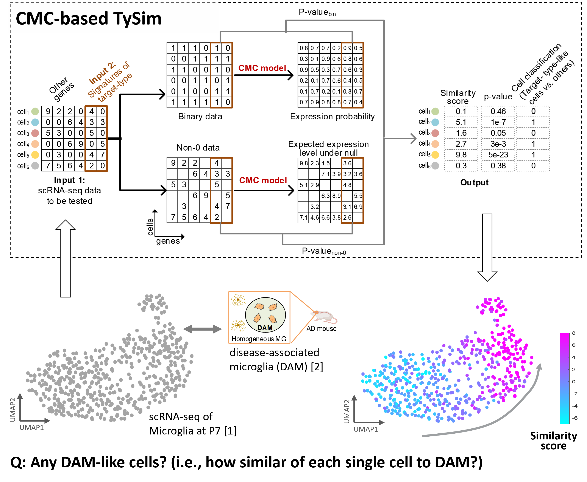
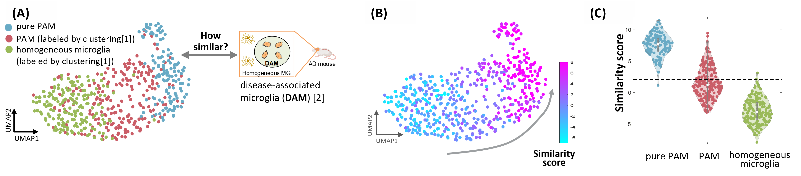
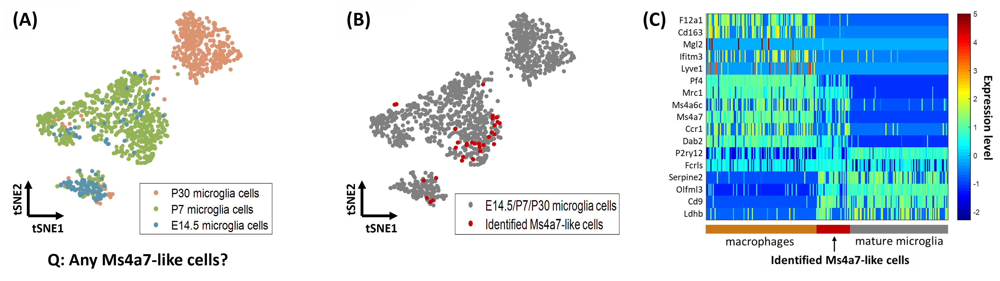
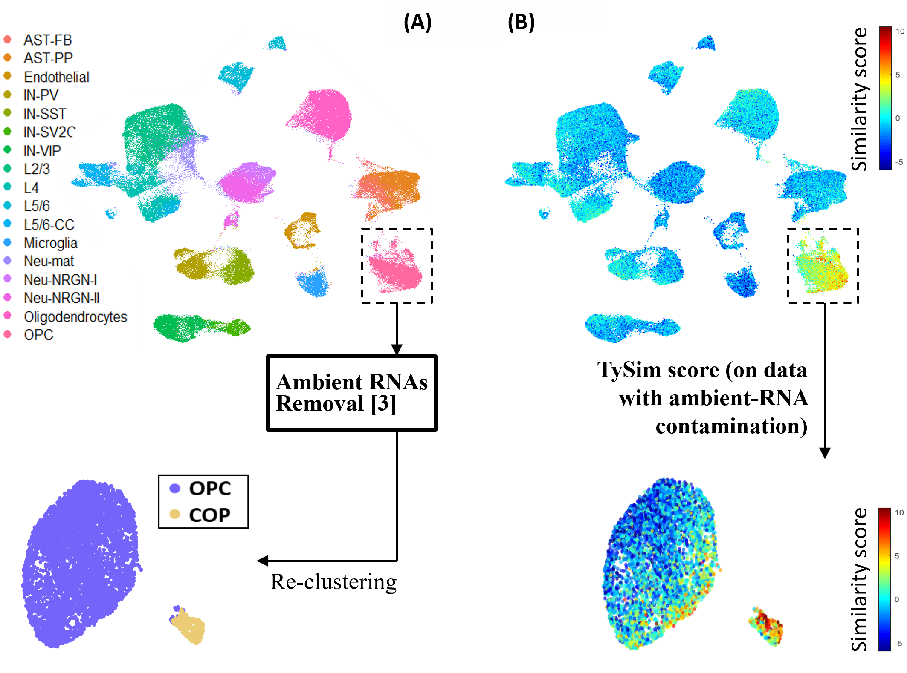

# What is TySim?

TySim is a quantitative metric of single-cell-to-target-cell-type similarity, on the basis of scRNA-seq data and the signatures or differentially expressed gene (DEG) list of the target cell type. In other words, it quantifies to what level each single cell is similar to the target cell type.

<!-- If you have any feedback or issue, you are welcome to either post issue in the Issues section or send an email to yug@vt.edu (Guoqiang Yu at Virginia Tech). -->

<!--  ### Overview of TySim -->
<p align="center">
  
  <!--  <figcaption>Overview of TySim</figcaption> -->
</p>


# How it work?

**Input**: (1) scRNA-seq data to be tested; (2) Signatures of target cell type. <br>
**Output**: Similarity level of each single cell to the target cell type (p-value & similarity score)

A cell is believed to be similar to a target cell type at the transcriptional level if it statistically significantly highly expresses the signatures of the target cell type than expected by random. Given the inputs, TySim performs statistical test to access the similarity levels.

# Why TySim?

To the best of our knowledge, TySim is the first quantitative metric of similarity towards a target cell type.

### Features of TySim:

1) **Single-cell resolution**: TySim quantities the similarity level of each single cell to a given cell type. Working on single cells also means that TySim does not require clustering and are free of the headaches in clustering, e.g. tiny cell group or inseparable groups. 

2) **Cross platform**: insensitive to the sequencing platform of input scRNA-seq dataset and the platform from which the signatures of target cell types coming.

### TySim is powerful in a few aspects:

1) Special designed to handle the drop-out effect in scRNA-seq datasets.

2) TySim carefully considers the background expression level of each gene in each cell. Such background expression levels are accurately estimated by systematically modeling both cell factors and gene factors in the inputted scRNA-seq data. This is achieved by employing the Conditional Multifactorial Contingency (CMC) model.


# Case studies using TySim
### 1) TySim confirms that Proliferative-region-associated microglia (PAM) is similar to disease-associated microglia (DAM) 

<br>


<p align="center">
  
  <!--  <figcaption>Overview of TySim</figcaption> -->
</p>

<!--   <div style="height: 10px;"></div> -->

### 2) TySim reveals cell type neglected by clustering due to small group size 

<br>
<p align="center">
  
  <!--  <figcaption>Overview of TySim</figcaption> -->
</p>

<div style="height: 5px;"></div>

### 3) TySim enables the identification of cell type that was not discovered due to contamination in scRNA-seq data

<br>
<p align="center">
  
  <!--  <figcaption>Overview of TySim</figcaption> -->
</p>

<div style="height: 5px;"></div>


# Installation

```
library(devtools)
devtools::install_github("yu-lab-vt/CMC@CMC-TySim")
```

# Example usage

library(TySim)

\# Read Original Data (Data: https://www.science.org/doi/10.1126/science.aaf6463?siteid=sci&keytype=ref&ijkey=dfIFbyl10QkCA)<br>
```Similarity_analysis_example <- Read_scData("GSE75330_Marques_et_al_mol_counts2.tab", Str_mt = "mt-")```

\# Quality Control<br>
```Similarity_analysis_example <- QC_scData(Similarity_analysis_example, Gene_threshold =0.05,Count_threshold = 3, Cell_threshold = 1400, MT_threshold = 0.05)```

\# Read signatures of target cell type<br>
```Similarity_analysis_example <- Read_Target_Genes(Similarity_analysis_example, "Signatures_target cell_type.txt")```

\# Run CMC Model
```Similarity_analysis_example <- Run_CMC(Similarity_analysis_example)``` 

\# Calculate Similarity Scores<br>
```Similarity_analysis_example <- TySim(Similarity_analysis_example)```


You may also want to attached the similarity scores to Seurat Object, so as to analysis the similarity scores together with Seurat's current results (e.g., visualizing the similarity scores in UMAP/tSNE plot)

\# Build Seurat Object<br>
```library(Seurat)```<br>
```Similarity_analysis_example <- Create_Seurat_Object(Similarity_analysis_example)```

\#Analysis using "Seurat" package
```
Seurat_Example <- Similarity_analysis_example$Seurat_Object
Seurat_Example <- NormalizeData(Seurat_Example, normalization.method = "LogNormalize", scale.factor = 10000)
Seurat_Example <- FindVariableFeatures(Seurat_Example, selection.method = "vst", nfeatures = 4000)
all.genes <- rownames(Seurat_Example)
Seurat_Example <- ScaleData(Seurat_Example, features = all.genes)
Seurat_Example <- RunPCA(Seurat_Example, features = VariableFeatures(object = Seurat_Example))
ElbowPlot(Seurat_Example)
Seurat_Example <- FindNeighbors(Seurat_Example, dims = 1:20)
Seurat_Example <- FindClusters(Seurat_Example, resolution = 0.5)
Seurat_Example <- RunUMAP(Seurat_Example, dims = 1:20)
DimPlot(Seurat_Example, reduction = "umap", pt.size = 1)
```

\# Visualize Similarity Scores Using UMAP Result<br>
```
FeaturePlot(Seurat_Example, features = c("Similarity_Minus_log10_p_Value"), pt.size = 1)
FeaturePlot(Seurat_Example, features = c("Similarity_Adjusted_Z_Score"), pt.size = 1)
```


# Cite

Please cite our paper if you find the code useful for your research.

Z. Cheng, S. Wei and G. Yu, "[A Single-Cell-Resolution Quantitative Metric of Similarity to a Target Cell Type for scRNA-seq Data](https://ieeexplore.ieee.org/abstract/document/9995574)," 2022 IEEE International Conference on Bioinformatics and Biomedicine (BIBM), Las Vegas, NV, USA, 2022, pp. 2824-2831, doi: 10.1109/BIBM55620.2022.9995574.

Zuolin Cheng, Songtao Wei, Yinxue Wang, Yizhi Wang, Richard Lu, Yue Wang, Guoqiang Yu， "[An Efficient and Principled Model to Jointly Learn the Agnostic and Multifactorial Effect in Large-Scale Biological Data](https://www.biorxiv.org/content/10.1101/2024.04.12.589306v1.full.pdf)," bioRxiv 2024.04.12.589306; doi: https://doi.org/10.1101/2024.04.12.589306

```
@inproceedings{TySim,
  title={A Single-Cell-Resolution Quantitative Metric of Similarity to a Target Cell Type for scRNA-seq Data},
  author={Cheng, Zuolin and Wei, Songtao and Yu, Guoqiang},
  booktitle={2022 IEEE International Conference on Bioinformatics and Biomedicine (BIBM)},
  pages={2824--2831},
  year={2022},
  organization={IEEE}
}

@article{cheng2024efficient,
  title={An Efficient and Principled Model to Jointly Learn the Agnostic and Multifactorial Effect in Large-Scale Biological Data},
  author={Cheng, Zuolin and Wei, Songtao and Wang, Yinxue and Wang, Yizhi and Lu, Richard and Wang, Yue and Yu, Guoqiang},
  journal={bioRxiv},
  pages={2024--04},
  year={2024},
  publisher={Cold Spring Harbor Laboratory}
}
```

# Contact us

If you need any assistance with running the packages, please contact songtaow@vt.edu or zuolin8@vt.edu


# Reference
[1]	Q. Li, Z. Cheng, L. Zhou, S. Darmanis, N. F. Neff, J. Okamoto et al., “Developmental heterogeneity of microglia and brain myeloid cells revealed by deep single-cell RNA sequencing,” Neuron, vol. 101, no. 2, pp. 207-223. e10, 2019.

[2]	H. Keren-Shaul, A. Spinrad, A. Weiner, O. Matcovitch-Natan, R. Dvir-Szternfeld, T. K. Ulland et al., “A unique microglia type associated with restricting development of Alzheimer’s disease,” Cell, vol. 169, no. 7, pp. 1276-1290. e17, 2017.

[3]	E. Caglayan, Y. Liu, and G. Konopka, “Neuronal ambient RNA contamination causes misinterpreted and masked cell types in brain single-nuclei datasets,” Neuron, 2022 

[4]	S. Marques, A. Zeisel, S. Codeluppi, D. Van Bruggen, et al., “Oligodendrocyte heterogeneity in the mouse juvenile and adult central nervous system,” Science, vol. 352, no. 6291, pp. 1326-1329, 2016.

[5]	D. Velmeshev, L. Schirmer, D. Jung, M. Haeussler, Y. Perez, S. Mayer et al., “Single-cell genomics identifies cell type–specific molecular changes in autism,” Science, vol. 364, no. 6441, pp. 685-689, 2019.

[6]	T. Masuda, R. Sankowski, O. Staszewski, and M. Prinz, “Microglia heterogeneity in the single-cell era,” Cell reports, vol. 30, no. 5, pp. 1271-1281, 2020.

[7]	T. R. Hammond, C. Dufort, L. Dissing-Olesen, S. Giera, A. Young, A. Wysoker et al., “Single-cell RNA sequencing of microglia throughout the mouse lifespan and in the injured brain reveals complex cell-state changes,” Immunity, vol. 50, no. 1, pp. 253-271. e6, 2019.

